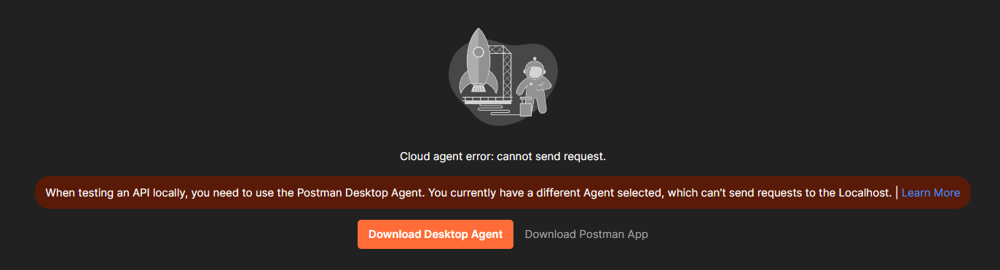

# Arab Tech Collective Resume Project

Welcome to Arab Tech Collective! We're here to propel your career in tech and the first step is a good resume. A unique project that demonstrates your technical acumen is a must have in the interview room. Everyone will take classes and do class projects, but only you will have completed a project built by Google, Amazon, and Meta Engineers!

By the end of this project you will learn:
- **Version Control** managing how to build and maintain a codebase
- **Cloud Infrastructure** developing and deploying code on the cloud
- **Integrations** interacting with third party servers like Twilio and WhatsApp 
- **Server Development** writing the kind of code you'll be working on a day to day basis during your future tech job
- **Interview Topic** you'll have a unique project to discuss during your interviews

### Difficulty Level
**Advanced** - This project assumes you know the following topics:
- `Data structures` you must be familiar with arrays (lists), dictionaries, objects, and classes.
- `Command Line / Terminal` you must be familiar with running commands on your machine's terminal and navigating the file system. [Learn Here](https://www.freecodecamp.org/news/how-to-use-the-cli-beginner-guide/)
- `Network Requests` you don't have to be a master, but you should be aware of http verbs (`GET` & `POST`), and the http protocol (JSON). [Learn Here](https://www.freecodecamp.org/news/http-and-everything-you-need-to-know-about-it/)
## Project Remember Your Umbrella
Picture this, you're walking down the street and it starts pouring rain. You've forgotten to bring an umbrella! If only a friend had remembered to check the weather and told you to bring an umbrella. Good thing you're a developer, you don't need friends! 

The objective of this project is to create a service that will check the weather every morning and send you a text message that reminds you to bring an umbrella if its going to rain. 

Lets go over all of the components that we'll need to make reach this objective

1. `GitHub` github is a popular place for us to store our code, it'll also be useful for other components to read our code. 
2. `Programming Language` we'll need to pick a programming language. There's plenty of good options, but we've selected Typescript for its easy learning curve and large community.
3. `Cloud Service` Our code needs to run on a server somewhere, we'll use Azure Cloud (microsoft's offering) since it has great integration with Github.
4. `Text Messaging Service` We need something to facilitate the communication between our server and our phone, for this we'll use Twilio.

### Prerequisites

Golden Rule: if you get stuck, ask [ChatGpt](https://chatgpt.com/)! It can give you step by step instructions on how to do any of the things in the setup.

**MacOs**
- ensure your operating system is up to date, and that you are using an admin account. 
- Install `brew` on your terminal 

**Windows**

- install the [Windows Subsystem for Linux.](https://learn.microsoft.com/en-us/windows/wsl/install)

**Both**

Download and [install Visual Studio Code](https://code.visualstudio.com/download), we'll use this to edit code. 

### Setting up your file system

We'll need somewhere to put our files, so lets start with the following commands:

```
mkdir ~/arabtechcollective
```
Creates a folder at root
```
cd ~/arabtechcollective
```
moves our command line to the folder. This is where we'll be doing the majority of our work. 

### Setting up your git repository
*Time Estimate - 1 hour*

If you're not familiar with git, do some pre-reading [here](https://docs.github.com/en/get-started/using-git/about-git). Ensure you have [git installed ](https://git-scm.com/book/en/v2/Getting-Started-Installing-Git). You can check by entering the following command: `git`, you should not get a message saying the command was not found. 

If you don't have one already, [create a github account](https://github.com/).

#### Setting Up Your SSH Key
We'll need to set up and ssh key to communicate to github from the command line on our local computer. If you don't know what ssh is, don't worry, its out of scope for this project. We'll be doing this once, so just follow the steps.

Follow the instructions [here](https://docs.github.com/en/authentication/connecting-to-github-with-ssh/generating-a-new-ssh-key-and-adding-it-to-the-ssh-agent?platform=mac)

For mac users select the mac tab at the top, for windows users select the linux tab since we are using windows subsystem for linux.

#### Creating the project repository

Go to [Create a new repository](https://github.com/new)

Name the project `remember-your-umbrella` (or whatever you want!)

The description can be empty, security can be public, and select `node` for the `Add .gitignore` dropdown.

Then hit `Create repository`


Copy the ssh string shown in the above image but either highlighting it or using the copy button just to the right of it. 

On your command line, enter the following

```
git clone <your-ssh-string>
```

If you've followed the steps in the prior section correctly, you'll be prompted with the following: 
```
The authenticity of host 'github.com (140.82.114.3)' can't be established.
ED25519 key fingerprint is SHA256:+DiY3wvvV6TuJJhbpZisF/zLDA0zPMSvHdkr4UvCOqU.
This key is not known by any other names
Are you sure you want to continue connecting (yes/no/[fingerprint])? yes
```

Enter yes and you should see that your remote repository is now on your local machine!

Enter the folder by using:
```
cd <repository-name>
```

You can now open this folder in Visual Studio Code by using the command: `code .` or by opening the application, selecting "open folder", and navigating to the folder. 

### Your first Typescript / NodeJs Application

This will be code that we'll use to create the logic that will remind us to bring an umbrella on a rainy day. 

As mentioned earlier, we'll be writing this in Typescript and NodeJs. If you don't know typescript, don't worry, we don't expect you to. If you're familiar with other programming languages like Javascript, java, and C++ you'll understand the code just fine.  

Lets start by installing the tools we need. We'll need:

- **nvm**
- **npm**
- **typescript**

Install `nvm` on your terminal by running the following command, we'll use this to install some related libraries. You may need to restart your terminal to use `nvm`
```
curl -o- https://raw.githubusercontent.com/nvm-sh/nvm/v0.40.1/install.sh | bash
```

To download, compile, and install the latest release of `node`, do this:
```
nvm install node
```

Now lets install our programming language 
```
npm install -g typescript
```

Verify that TypeScript is installed by running the following:
```
tsc -v
```

Great! We have the tools we need to start writing our project!

The following commands should be run on your command line in your project folder. Your command line should look something like: `username@username:~/remember-your-umbrella$`

Initialize a new `Node.js` project. This will create the `package.json`, the file the defines the settings for our application, we'll use the defaults. 
```
npm init -y
```

Create a `tsconfig.json` file in the root of your project:

```
npx tsc --init
```

This file will define the settings for `typescript`, we'll use the defaults.

Now that we're done with the setup, now is a good time to save our changes by using git.

### Making changes as a software engineer
Making changes, adding them to a `branch`, creating a `pull request` and `merging` your changes are a daily task as a software engineer, so this is a great practice and definitely worth mentioning that you have experience with in an interview. 

First lets create a branch. (if you're new to git, read up [here](https://www.freecodecamp.org/news/learn-the-basics-of-git-in-under-10-minutes-da548267cc91/))
```
git branch settings
```
Then move onto the branch
```
git checkout settings
```
Now lets view the changes we have thus far
```
git status
```
You should see all of the new files you've added listed. Lets `stage` them to be `commited`
```
git add -A
```
now `commit` your changes and push them. Add a helpful message explaining the changes.

```
git commit -m "<your message here>"
git push --set-upstream origin settings
```

Time to create a pull request. Navigate to:
```
https://github.com/<your-github-username>/<your-repository-name>/pulls
```




Select the branch you just created from the dropdown and git `Create Pull Request`. Add a title and description of the changes. 
Let's start by creating a basic `express` application. `express` is a library for making network requests. 

